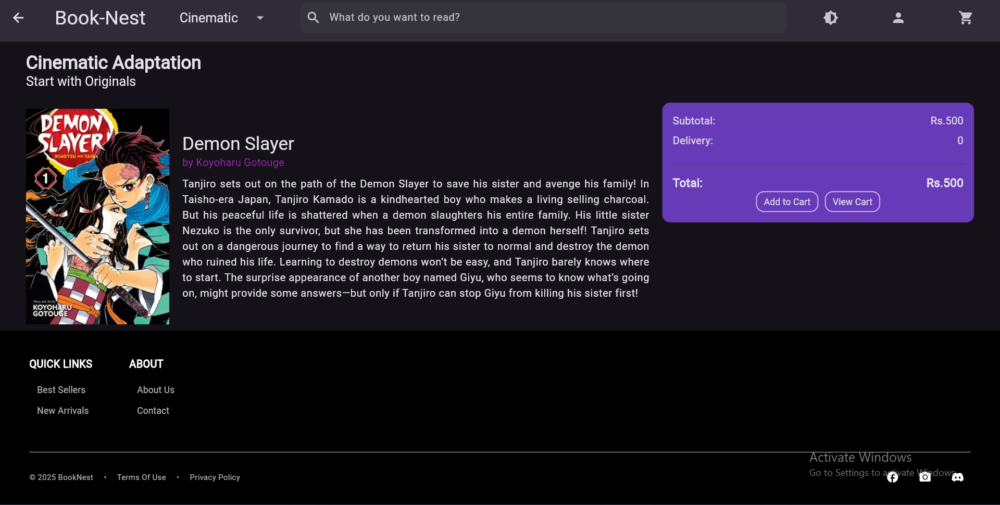
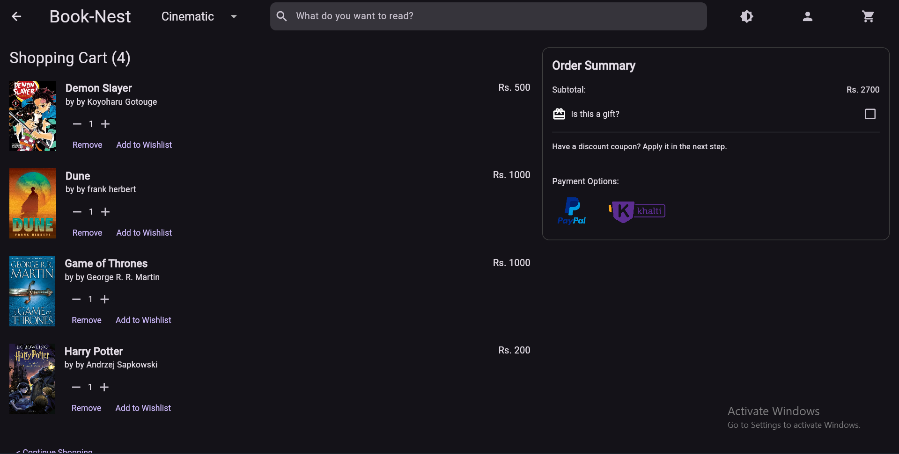

```markdown
# 📚 BookNest

A full stack **bookstore application** built using **Flutter** for the frontend and **.NET Web API** for the backend.

## Overview

BookNest allows users to browse, purchase books seamlessly.  
It supports **Khalti** for national payments and **PayPal** for international transactions.  
The app also features **offline caching** via Hive DB for fast and smooth user experience.

---

## 🧩 Tech Stack

- **Frontend:** Flutter  
- **Backend:** .NET Web API  
- **Local Storage:** Hive DB  
- **Payments:** Khalti (National), PayPal (International)

---

## 📂 Project Structure

```

booknest/
├── flutter_frontend/       # UI + payment + Hive caching
└── dotnet_backend/         # API endpoints + database + payment logic

````

---

## ✨ Main Features

- Browse and search books  
- View book details and prices  
- Secure checkout with Khalti & PayPal  
- Offline caching using Hive DB  
- User authentication  
- RESTful backend integration with Flutter frontend  

---

## ⚙️ Setup Instructions

### 🖥️ Frontend (Flutter)

```bash

flutter pub get
flutter run
````

### ⚡ Backend (.NET)

```bash
cd dotnet_backend
dotnet restore
dotnet run
```

---

## 🔧 Configuration

* Add your **Khalti** and **PayPal** API credentials in the backend configuration (`appsettings.json`)
* Set up your **Firebase** project if authentication is enabled
* Do **not** commit sensitive files such as API keys, credentials, or database files

---

## 🖼️ Screenshots / Demo

### Home Page


### Book Details



### Checkout Page



---

## 🚀 Status

Stable build version of BookNest.

---


